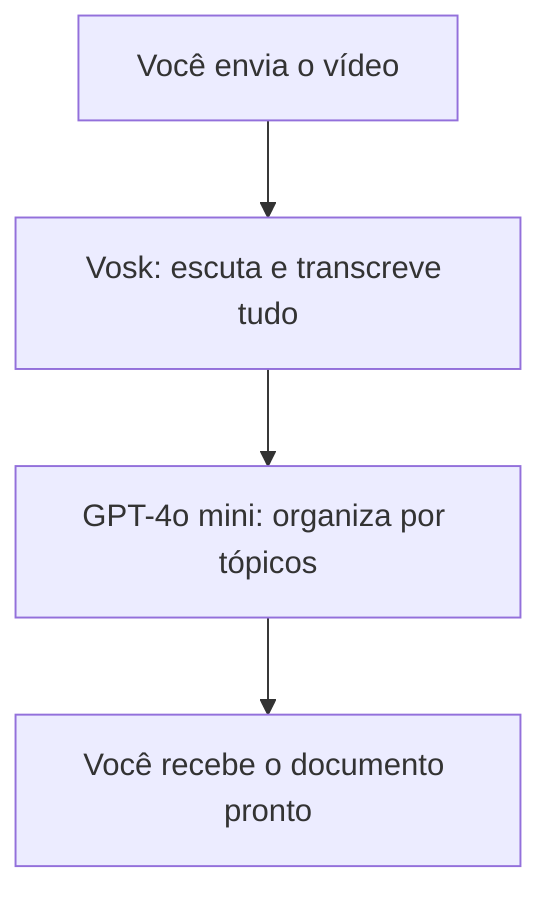

# Estratégia de Transcrição Inteligente: Da Limitação à Solução Escalável

---

## Como era antes?

No início do projeto, a ideia era usar o modelo GPT-4o mini para transcrever diretamente o áudio dos vídeos. Porém, logo surgiu uma limitação técnica importante: o GPT só aceita áudios de até 1400 segundos (cerca de 23 minutos) por requisição. Para vídeos maiores, era necessário dividir o arquivo em partes menores, processar cada uma separadamente e depois tentar juntar tudo.

### Problemas do fluxo antigo:
- Divisão manual ou automática do vídeo
- Risco de perder contexto entre partes
- Mais complexidade no código e no uso
- Maior tempo de processamento
- Resultado final pouco organizado

## O que mudou?

Após testes e análise das dores, decidimos separar as responsabilidades e usar o melhor de cada tecnologia:

- **Vosk** passou a ser o responsável por transcrever o vídeo inteiro, sem limitação de tempo. Ele gera o texto bruto de tudo que foi falado.
- **GPT-4o mini** ficou encarregado de organizar esse texto, sumarizar e estruturar em tópicos, gerando um documento final em Markdown.

## Por que essa mudança?

- **Eficiência**: O Vosk processa qualquer vídeo, sem cortes ou divisões.
- **Qualidade**: O GPT-4o mini organiza o texto, tornando o resultado útil e fácil de ler.
- **Simplicidade**: O fluxo ficou mais simples, fácil de manter e escalar.
- **Experiência do usuário**: O usuário recebe um documento pronto, organizado e pronto para uso.

## Para onde estamos indo?

Com essa arquitetura, o projeto está preparado para:
- Processar vídeos de qualquer tamanho
- Entregar resultados organizados, sumarizados e prontos para consulta
- Evoluir para integrar novos modelos, formatos e funcionalidades
- Atender tanto usuários técnicos quanto leigos

## Como funciona o novo fluxo?

O processo ficou simples e eficiente:

1. **Você envia o vídeo (MP4)**
2. O Vosk escuta tudo e escreve o que foi falado (transcrição completa)
3. O GPT-4o mini pega esse texto e organiza em tópicos, como se fosse um resumo inteligente
4. Você recebe o resultado final já pronto para usar, copiar ou compartilhar

### Visual do fluxo

---

## Contexto Pessoal e Convite à Comunidade

Precisei transcrever vídeos para documentar reuniões e acabei criando uma ferramenta: **MP4 for Text**.

O mais interessante foi poder testar ideias usando o GitHub Copilot, custom instructions e prompts para automatizar o fluxo.

O resultado? Uma solução open source que transforma gravações em texto consultivo, pronta para gerar relatórios, atas ou análise.

Não é nada mirabolante, mas resolve o problema de quem precisa documentar conversas importantes sem depender de recursos pagos.

Se você também grava reuniões e quer documentar tudo sem dor de cabeça (e sem depender de recursos pagos), fica o convite para testar!

---

## Conclusão

A decisão de separar transcrição e organização/sumarização foi fundamental para superar limitações técnicas, melhorar a experiência do usuário e garantir escalabilidade. O projeto agora é mais robusto, flexível e pronto para crescer.

---

Se quiser entender o fluxo técnico ou visualizar exemplos, confira os arquivos DECISAO_ARQUITETURAL.md e FLUXO_SIMPLIFICADO.md na pasta docs do projeto.
