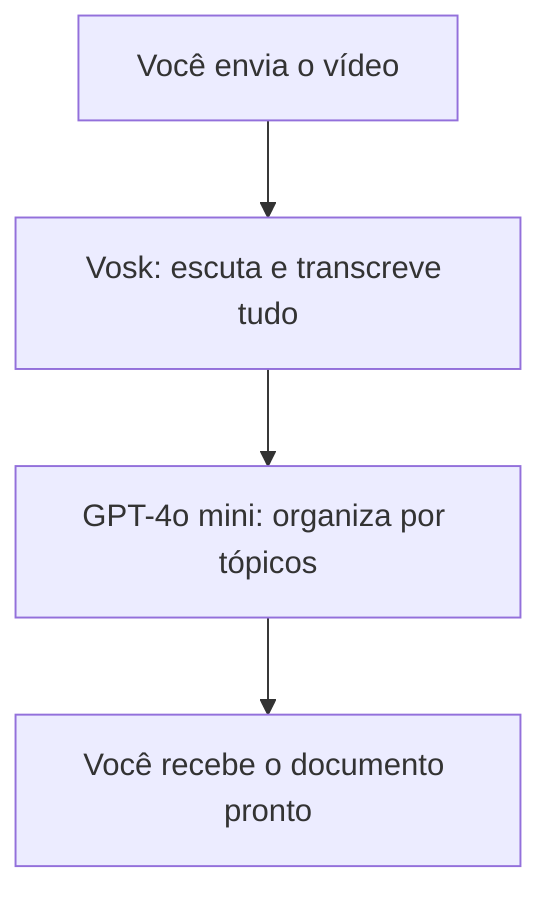

# Como funciona a transcrição inteligente de vídeos neste projeto?

---

## Para quem é desenvolvedor (nerd) e para quem é leigo!

### O problema

Quando você tem um vídeo longo e quer transformar o áudio em texto organizado, a maioria das inteligências artificiais (IA) tem um limite: só conseguem processar cerca de 23 minutos de áudio por vez. Se o vídeo for maior, precisa dividir em partes, o que complica tudo e pode perder contexto.

### A solução deste projeto

Aqui, usamos dois "robôs" diferentes, cada um com uma função:

1. **Vosk**: É um robô que entende áudio e transforma tudo em texto, sem limite de tempo. Ele pega o vídeo inteiro e gera a transcrição completa.

2. **GPT-4o mini**: É um robô que entende texto e sabe organizar ideias. Ele pega o texto gerado pelo Vosk e transforma em um documento bonito, separado por tópicos, em formato Markdown (que é fácil de ler e compartilhar).

### O fluxo passo a passo

1. **Você envia o vídeo (MP4)**
2. O Vosk escuta tudo e escreve o que foi falado
3. O GPT-4o mini pega esse texto e organiza em tópicos, como se fosse um resumo inteligente
4. Você recebe o resultado final já pronto para usar, copiar ou compartilhar

---

## Visual do fluxo



---

## Por que isso é melhor?

- Não precisa dividir o vídeo em partes
- O resultado é organizado e fácil de entender
- Serve para reuniões, aulas, entrevistas, podcasts, etc
- Qualquer pessoa pode usar, sem precisar entender de IA

---

## Exemplo de resultado

```markdown
# Reunião de Projeto

## Introdução
- Apresentação dos participantes
- Objetivo da reunião

## Discussão
- Pontos principais abordados
- Decisões tomadas

## Encerramento
- Próximos passos
- Agradecimentos
```

---

Se quiser saber mais detalhes técnicos, veja o arquivo DECISAO_ARQUITETURAL.md!
