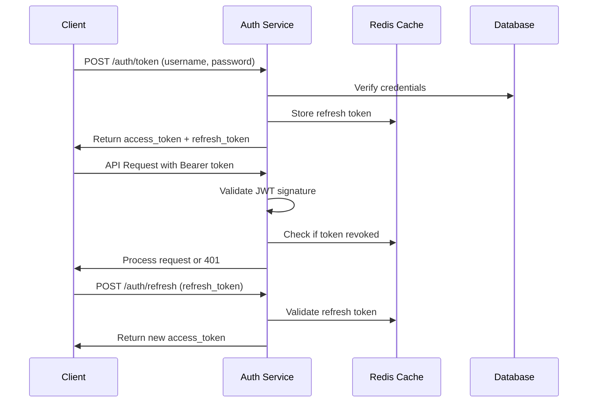

# 🚦 Sistema de Controle de Concorrência e Autenticação

## 📋 Visão Geral

A API implementa um sistema robusto de controle de concorrência e autenticação JWT para garantir:

- ✅ **Fair usage** do serviço Vosk gratuito
- ✅ **Controle de qualidade** e performance
- ✅ **Segurança** via autenticação JWT
- ✅ **Escalabilidade** com filas inteligentes

## 🔐 Sistema de Autenticação JWT

### **Fluxo Completo de Autenticação**



### **Estrutura de Usuários**

```python
class UserType(str, Enum):
    FREE = "free"           # Usuário gratuito
    PREMIUM = "premium"     # Usuário premium
    ADMIN = "admin"         # Administrador

class User(BaseModel):
    id: str
    email: str
    user_type: UserType
    permissions: List[str]
    limits: UserLimits
    created_at: datetime
    is_active: bool = True

class UserLimits(BaseModel):
    # Vosk (gratuito)
    max_concurrent_vosk: int
    max_daily_vosk: int
    max_monthly_vosk: int
    
    # OpenAI (pago)
    max_concurrent_openai: int
    max_monthly_openai: int
    
    # Arquivos
    max_file_size_mb: int
    max_duration_minutes: int
    
    # Fila
    queue_priority: int      # 1=alta, 2=média, 3=baixa
```

### **Configurações por Tipo de Usuário**

```python
USER_CONFIGS = {
    UserType.FREE: UserLimits(
        max_concurrent_vosk=1,        # 1 transcrição simultânea
        max_daily_vosk=10,            # 10 transcrições por dia
        max_monthly_vosk=100,         # 100 transcrições por mês
        max_concurrent_openai=0,      # Sem acesso ao OpenAI
        max_monthly_openai=0,
        max_file_size_mb=100,         # 100MB máximo
        max_duration_minutes=60,      # 1 hora máxima
        queue_priority=3              # Prioridade baixa
    ),
    
    UserType.PREMIUM: UserLimits(
        max_concurrent_vosk=3,        # 3 transcrições simultâneas
        max_daily_vosk=50,            # 50 transcrições por dia  
        max_monthly_vosk=1000,        # 1000 transcrições por mês
        max_concurrent_openai=2,      # 2 transcrições OpenAI simultâneas
        max_monthly_openai=100,       # 100 transcrições OpenAI por mês
        max_file_size_mb=500,         # 500MB máximo
        max_duration_minutes=180,     # 3 horas máxima
        queue_priority=2              # Prioridade média
    ),
    
    UserType.ADMIN: UserLimits(
        max_concurrent_vosk=10,       # 10 transcrições simultâneas
        max_daily_vosk=999999,        # Ilimitado
        max_monthly_vosk=999999,      # Ilimitado
        max_concurrent_openai=5,      # 5 transcrições OpenAI simultâneas
        max_monthly_openai=999999,    # Ilimitado
        max_file_size_mb=1000,        # 1GB máximo
        max_duration_minutes=480,     # 8 horas máxima
        queue_priority=1              # Prioridade alta
    )
}
```

## 🚦 Sistema de Filas e Concorrência

### **Arquitetura do Queue Manager**

```python
class QueueManager:
    def __init__(self):
        # Filas separadas por prioridade
        self.high_priority_queue = asyncio.PriorityQueue()    # Admin
        self.medium_priority_queue = asyncio.PriorityQueue()  # Premium  
        self.low_priority_queue = asyncio.PriorityQueue()     # Free
        
        # Controle de slots de processamento
        self.max_concurrent_vosk = 3      # Total simultâneo no servidor
        self.active_jobs = {}             # Jobs ativos: {user_id: [job_ids]}
        self.job_semaphore = asyncio.Semaphore(3)  # Limita processamento
        
        # Métricas
        self.total_processed = 0
        self.total_queued = 0
        self.processing_times = []
    
    async def enqueue_job(self, user: User, job: TranscriptionJob) -> QueueResponse:
        """Adiciona job à fila apropriada com verificações"""
        
        # 1. Verificar limites de concorrência por usuário
        user_active_jobs = len(self.active_jobs.get(user.id, []))
        if user_active_jobs >= user.limits.max_concurrent_vosk:
            raise HTTPException(
                status_code=429,
                detail={
                    "error": "concurrent_limit_exceeded",
                    "message": f"Limite de {user.limits.max_concurrent_vosk} jobs simultâneos atingido",
                    "current_jobs": user_active_jobs,
                    "max_concurrent": user.limits.max_concurrent_vosk
                }
            )
        
        # 2. Verificar limite diário
        daily_usage = await self.get_daily_usage(user.id)
        if daily_usage >= user.limits.max_daily_vosk:
            raise HTTPException(
                status_code=429,
                detail={
                    "error": "daily_limit_exceeded",
                    "message": f"Limite diário de {user.limits.max_daily_vosk} transcrições atingido",
                    "daily_used": daily_usage,
                    "daily_limit": user.limits.max_daily_vosk,
                    "resets_at": self.get_next_reset_time()
                }
            )
        
        # 3. Verificar tamanho do arquivo
        if job.file_size_mb > user.limits.max_file_size_mb:
            raise HTTPException(
                status_code=413,
                detail=f"Arquivo muito grande. Máximo: {user.limits.max_file_size_mb}MB"
            )
        
        # 4. Verificar duração do arquivo
        if job.duration_minutes > user.limits.max_duration_minutes:
            raise HTTPException(
                status_code=413,
                detail=f"Arquivo muito longo. Máximo: {user.limits.max_duration_minutes} minutos"
            )
        
        # 5. Selecionar fila baseada na prioridade
        queue = self._get_queue_by_priority(user.limits.queue_priority)
        
        # 6. Adicionar à fila
        queue_item = QueueItem(
            priority=user.limits.queue_priority,
            timestamp=time.time(),
            user_id=user.id,
            job=job
        )
        
        await queue.put(queue_item)
        self.total_queued += 1
        
        # 7. Calcular posição na fila e tempo estimado
        position = await self._calculate_queue_position(user.limits.queue_priority)
        estimated_wait = await self._estimate_wait_time(position)
        
        return QueueResponse(
            job_id=job.id,
            status="queued",
            queue_position=position,
            estimated_wait_minutes=estimated_wait,
            message=f"Job adicionado à fila de prioridade {user.limits.queue_priority}"
        )
    
    async def process_queues(self):
        """Background task que processa as filas por prioridade"""
        while True:
            async with self.job_semaphore:  # Limita concorrência global
                
                # Processa filas por prioridade: alta -> média -> baixa
                job_item = None
                
                # Prioridade 1 (Admin) - sempre primeiro
                if not self.high_priority_queue.empty():
                    job_item = await self.high_priority_queue.get()
                
                # Prioridade 2 (Premium) - se não há admin
                elif not self.medium_priority_queue.empty():
                    job_item = await self.medium_priority_queue.get()
                
                # Prioridade 3 (Free) - se não há premium nem admin
                elif not self.low_priority_queue.empty():
                    job_item = await self.low_priority_queue.get()
                
                if job_item:
                    # Processa o job assincronamente
                    task = asyncio.create_task(
                        self._process_transcription_job(job_item)
                    )
                    
                    # Registra job ativo
                    if job_item.user_id not in self.active_jobs:
                        self.active_jobs[job_item.user_id] = []
                    self.active_jobs[job_item.user_id].append(job_item.job.id)
                    
                    # Cleanup quando completar
                    task.add_done_callback(
                        lambda t, uid=job_item.user_id, jid=job_item.job.id: 
                        self._cleanup_job(uid, jid)
                    )
                
                else:
                    # Nenhum job na fila, aguarda
                    await asyncio.sleep(1)
    
    def _get_queue_by_priority(self, priority: int) -> asyncio.PriorityQueue:
        """Retorna fila baseada na prioridade"""
        if priority == 1:
            return self.high_priority_queue
        elif priority == 2:
            return self.medium_priority_queue
        else:
            return self.low_priority_queue
    
    async def _calculate_queue_position(self, user_priority: int) -> int:
        """Calcula posição na fila considerando prioridades"""
        position = 0
        
        # Conta jobs de prioridade maior ou igual
        if user_priority >= 1:
            position += self.high_priority_queue.qsize()
        if user_priority >= 2:
            position += self.medium_priority_queue.qsize()
        if user_priority >= 3:
            position += self.low_priority_queue.qsize()
        
        return position
    
    async def _estimate_wait_time(self, position: int) -> int:
        """Estima tempo de espera baseado na posição e histórico"""
        if position == 0:
            return 0
        
        # Calcula tempo médio de processamento
        if self.processing_times:
            avg_processing_time = sum(self.processing_times[-10:]) / len(self.processing_times[-10:])
        else:
            avg_processing_time = 120  # 2 minutos default
        
        # Considera slots disponíveis
        available_slots = max(1, self.max_concurrent_vosk - len(self.active_jobs))
        
        # Tempo estimado = (posição / slots) * tempo_médio
        estimated_seconds = (position / available_slots) * avg_processing_time
        return int(estimated_seconds / 60)  # Retorna em minutos
```

### **Rate Limiting Distribuído**

```python
class RateLimiter:
    def __init__(self, redis_client):
        self.redis = redis_client
    
    async def check_daily_limit(self, user_id: str, service: str) -> bool:
        """Verifica limite diário"""
        today = date.today().isoformat()
        key = f"rate_limit:daily:{service}:{user_id}:{today}"
        
        current_count = await self.redis.get(key)
        return int(current_count or 0)
    
    async def increment_usage(self, user_id: str, service: str) -> int:
        """Incrementa contador de uso"""
        today = date.today().isoformat()
        key = f"rate_limit:daily:{service}:{user_id}:{today}"
        
        # Incrementa e define expiração para fim do dia
        count = await self.redis.incr(key)
        await self.redis.expireat(key, int(datetime.combine(
            date.today() + timedelta(days=1), 
            datetime.min.time()
        ).timestamp()))
        
        return count
    
    async def get_usage_stats(self, user_id: str) -> dict:
        """Retorna estatísticas de uso do usuário"""
        today = date.today().isoformat()
        
        daily_vosk = await self.redis.get(f"rate_limit:daily:vosk:{user_id}:{today}") or 0
        monthly_vosk = await self._get_monthly_usage(user_id, "vosk")
        monthly_openai = await self._get_monthly_usage(user_id, "openai")
        
        return {
            "daily_vosk": int(daily_vosk),
            "monthly_vosk": monthly_vosk,
            "monthly_openai": monthly_openai
        }
```

## 📊 Monitoramento e Métricas

### **Dashboard de Sistema**

```python
class SystemMetrics:
    async def get_system_status(self) -> dict:
        """Retorna status completo do sistema"""
        return {
            "timestamp": datetime.utcnow().isoformat(),
            "queue_status": {
                "high_priority": queue_manager.high_priority_queue.qsize(),
                "medium_priority": queue_manager.medium_priority_queue.qsize(),
                "low_priority": queue_manager.low_priority_queue.qsize(),
                "total_queued": queue_manager.total_queued,
                "active_jobs": len(queue_manager.active_jobs)
            },
            "processing": {
                "total_slots": queue_manager.max_concurrent_vosk,
                "used_slots": len(queue_manager.active_jobs),
                "available_slots": queue_manager.max_concurrent_vosk - len(queue_manager.active_jobs),
                "avg_processing_time_seconds": self._get_avg_processing_time()
            },
            "usage_stats": {
                "total_processed_today": await self._get_daily_total(),
                "free_users_active": await self._get_active_users("free"),
                "premium_users_active": await self._get_active_users("premium"),
                "admin_users_active": await self._get_active_users("admin")
            },
            "performance": {
                "cpu_usage_percent": psutil.cpu_percent(),
                "memory_usage_percent": psutil.virtual_memory().percent,
                "disk_usage_percent": psutil.disk_usage("/").percent,
                "vosk_model_loaded": vosk_service.is_model_loaded()
            }
        }
```

### **Alertas Automáticos**

```python
class AlertManager:
    async def check_system_health(self):
        """Verifica saúde do sistema e envia alertas"""
        
        # Alerta: Fila muito grande
        total_queue_size = (
            queue_manager.high_priority_queue.qsize() +
            queue_manager.medium_priority_queue.qsize() +
            queue_manager.low_priority_queue.qsize()
        )
        
        if total_queue_size > 20:
            await self.send_alert(
                "QUEUE_SIZE_HIGH",
                f"Fila com {total_queue_size} jobs. Considere aumentar capacidade."
            )
        
        # Alerta: Tempo de processamento alto
        avg_time = queue_manager._get_avg_processing_time()
        if avg_time > 300:  # 5 minutos
            await self.send_alert(
                "PROCESSING_TIME_HIGH", 
                f"Tempo médio de processamento: {avg_time}s"
            )
        
        # Alerta: Muitos usuários free
        free_active = await self._get_active_users("free")
        if free_active > 50:
            await self.send_alert(
                "FREE_USERS_HIGH",
                f"{free_active} usuários free ativos. Considere otimizações."
            )
```

## 🎯 Estratégias de Otimização

### **Fair Usage Enforcement**

```python
class FairUsageEnforcer:
    async def apply_fair_usage_rules(self, user: User, job: TranscriptionJob):
        """Aplica regras de uso justo"""
        
        # Regra 1: Usuários free com uso intensivo esperam mais
        if user.user_type == UserType.FREE:
            recent_usage = await self._get_recent_usage(user.id, hours=1)
            if recent_usage > 3:  # Mais de 3 transcrições na última hora
                # Adiciona delay artificial
                await asyncio.sleep(30)  # 30 segundos de delay
        
        # Regra 2: Arquivos grandes de usuários free têm prioridade baixa
        if user.user_type == UserType.FREE and job.duration_minutes > 30:
            # Força prioridade mínima
            job.priority = 4  # Ainda menor que prioridade 3
        
        # Regra 3: Detecta possível abuso
        daily_usage = await rate_limiter.get_daily_usage(user.id, "vosk")
        if daily_usage > user.limits.max_daily_vosk * 0.8:  # 80% do limite
            # Adiciona delay progressivo
            delay = min(60, (daily_usage - user.limits.max_daily_vosk * 0.8) * 10)
            await asyncio.sleep(delay)
```

### **Dynamic Scaling**

```python
class DynamicScaler:
    async def adjust_capacity(self):
        """Ajusta capacidade baseado na demanda"""
        
        total_queue = await queue_manager.get_total_queue_size()
        active_jobs = len(queue_manager.active_jobs)
        
        # Aumenta slots se fila está grande e CPU/memória OK
        if total_queue > 10 and active_jobs < 5:
            cpu_usage = psutil.cpu_percent()
            memory_usage = psutil.virtual_memory().percent
            
            if cpu_usage < 70 and memory_usage < 80:
                queue_manager.max_concurrent_vosk = min(6, queue_manager.max_concurrent_vosk + 1)
                logger.info(f"Increased capacity to {queue_manager.max_concurrent_vosk} slots")
        
        # Diminui slots se sistema sob pressão
        elif cpu_usage > 90 or memory_usage > 90:
            queue_manager.max_concurrent_vosk = max(2, queue_manager.max_concurrent_vosk - 1)
            logger.warning(f"Decreased capacity to {queue_manager.max_concurrent_vosk} slots")
```

## 🛡️ Prevenção de Abuso

### **Detecção de Padrões Suspeitos**

```python
class AbuseDetector:
    async def analyze_user_behavior(self, user_id: str) -> dict:
        """Analisa comportamento do usuário para detectar abuso"""
        
        # Padrão 1: Upload rápido demais
        recent_uploads = await self._get_recent_uploads(user_id, minutes=5)
        if len(recent_uploads) > 5:
            return {"suspicious": True, "reason": "rapid_uploads"}
        
        # Padrão 2: Sempre no limite máximo
        usage_history = await self._get_usage_history(user_id, days=7)
        max_usage_days = sum(1 for day in usage_history if day >= user.limits.max_daily_vosk)
        if max_usage_days > 5:  # 5 dias seguidos no limite
            return {"suspicious": True, "reason": "consistent_max_usage"}
        
        # Padrão 3: Arquivos sempre próximos do limite de tamanho
        file_sizes = await self._get_recent_file_sizes(user_id, days=7)
        large_files = sum(1 for size in file_sizes if size > user.limits.max_file_size_mb * 0.9)
        if large_files > len(file_sizes) * 0.8:  # 80% dos arquivos são grandes
            return {"suspicious": True, "reason": "consistently_large_files"}
        
        return {"suspicious": False}
```

---

Este sistema garante que a API seja **justa**, **eficiente** e **escalável**, protegendo o serviço gratuito contra abuso enquanto oferece experiência premium para usuários pagantes.
